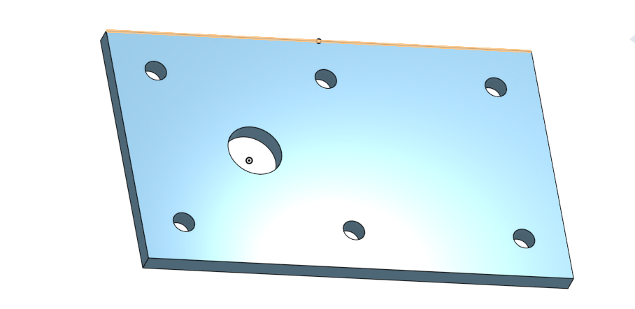

# BasicCAD

## Assignment

Making the base for the caster in Onshape

## Picture

## Reflection

In the beginning, I struggled making the "Sketch" and getting the "Extrude" features to work, but I finally figured it out. I enjoyed making this because I really like 3D design. I look forward to making the rest of the caster.

## Onshape Document Link

https://cad.onshape.com/documents/552a75c83439016c914fcabd/w/2f696d226eafe0c0d9923517/e/b7ff6d136de01bbe54c19693
