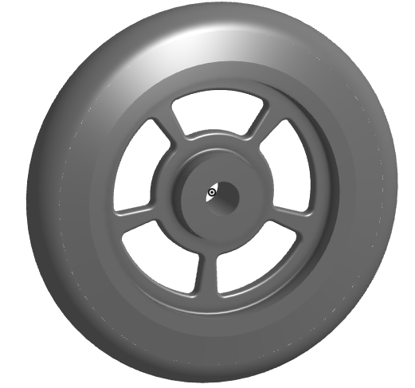

# BasicCAD

We are creating a caster.

---
## Table of Contents
* [Table of Contents](#Table-of-Contents)
* [Base](#Base)
* [Mount](#Mount)
* [Fork](#Fork)
* [Tire](#Tire)
* [Wheel](#Wheel)
* [AxleCollarBearings](#AxleCollarBearings)

## Base

### Description

The first assignment is to create the caster base.  The base's dimensions are 200 mm x 120 mm and 8 mm thick.  It has 6 holes 10 mm wide and 20 mm from the edge equally spaced along the edges.

### Evidence
[The Base in Onshape](https://cad.onshape.com/documents/552a75c83439016c914fcabd/w/2f696d226eafe0c0d9923517/e/b7ff6d136de01bbe54c19693)

### Image

### Reflection

This was my first Onshape part and [following along with Dr. Shields made it super easy.](https://www.youtube.com/watch?v=93BFUD-HAG8&feature=emb_title&scrlybrkr=5670f0b4)  I learned about 
* sketching (shortcut **shift-s**)
* constructions lines (shortcut **Q**)
* dimensions (shortcut **D**)
* extruding both add and remove (shortcut key **E**)
* linear patterns (no shortcut)

Onshape is awesome.  I found it really helpful to rename all my sketches.  It is going to be a GREAT year in engineering.

---

## Mount

### Description

The second part is to create the mount which is a 120mm x 120mm part that is 8mm thick. It has four holes that are 10mm wide and 20mm from each side.

### Evidence
[The Mount in Onshape](https://cad.onshape.com/documents/552a75c83439016c914fcabd/w/2f696d226eafe0c0d9923517/e/b7ff6d136de01bbe54c19693)

### Image

### Reflection

This was my second Onshape part and [following along with Dr. Shields made it super easy.](https://youtu.be/BWDk4BZFXDQ) I struggled with the extrusion because I did my mount a little different than the instruction. I used the same document as my base and just added on to it. I tried extruding the sketch, but I ended up only extruding the walls and not the middle of my mount. I figured it out by retracing my steps and found out what I did wrong. I am done with 2 parts of ths assignment. I am excited to move on to the next part.

---

## Fork

### Description

I made a circle that was 80mm in diameter and 8mm thick. Then, I made a rectangle that was 15 x 5mm and 75mm thick. Then, we had to create two circles. On was 15mm and the other was 20mm and 60mm tall. I put a 10mm hole in the rectangle and reflected it over the axis. 

### Evidence

[The Fork in Onshape](https://cad.onshape.com/documents/561e54026ef6a378c2a00a3a/w/b20fec73a23eab2d094f270f/e/d1d6ae39e5c6a7a754a9a615)

### Image

### Reflection

This was my third Onshape part and [following along with Dr. Shields made it super easy.](https://youtu.be/wQlTfOw8rYQ) I struggled making the holes in the tongues of the fork, but I ended up just deleting the sketch of the hole and doing it again. It work the second time I did it and I am glad that I tried again before asking for help. I like working through the problem by myself. I am ready to start the next part.

---

## Tire

### Description

I made a trapezoid that was 20mm on the bottom and then the sides were 10 degress from vertical. The botom was 40mm from the x-axis and the top was 55mm from the x-axis. Then I rotated it around the line and put fillets on the corners to round it off.

### Evidence

[The Tire in Onshape](https://cad.onshape.com/documents/deecaecaea7a37ff59c23347/w/60437cceb0d772b11ef00f0c/e/26ab35dfdd7e5aea8aa16f03)

### Image

### Reflection

This was my fourth Onshape part and [following along with Dr. Shields made it super easy.](https://youtu.be/ReEGioIYSus) I am close to being done with the caster! I had problems getting the degrees right on the trapezoid, but I figured it out by watching the video again and retracing my steps. I enjoyed making this part. It didn't take very long at all. I am excited to start the last two parts for this assinment.

---

## Wheel

### Description

I made three corner rectangles that made an "I" shape. It is 20mm wide. I demensioned each rectangle and made it symmetric and then rotated it around the axis. Then, I made a "V" shape and did a extrude remove and filleted the edges of one spoke hole. Finally, I made a circular pattern of five spoke holes on the wheel.

### Evidence

[The Wheel in Onshape](https://cad.onshape.com/documents/deecaecaea7a37ff59c23347/w/60437cceb0d772b11ef00f0c/e/26ab35dfdd7e5aea8aa16f03)

### Image

### Reflection

This was my fifth Onshape part and [following along with Dr. Shields made it super easy.](https://youtu.be/RKeALFyqSGw) This was the hardest part I have had to make so far. I struggled making the wheel and tire in the same document, but ended up going back and making the wheel in the same document. I still don't know how to make them two different colors, but I am going to try to figure that out soon. I am excited to start the next part.

---

## AxleCollarBearings

### Description

I made two circles, extruded them 60mm, symmetrically, and used the "use" button to shave off some space on the top of the cylinder on each side. That was my axle. To make the collar, I made two more circles, extruded them on the axle 10mm, and used the "use" tool again to make a hole in the top of it. To make my bearing, I just went into my "wheel" document, used the "use" tool, clicked the two circles on the side of the wheel, and extruded it 5mm.

### Evidence

[The Axle, Collar, and Bearing in Onshape](https://cad.onshape.com/documents/58cb2d9216043d0a530e6867/w/e01df4a00b5bd16c04ad6b0f/e/49c7f7fac6fa8d039af7529c)

### Image

### Reflection

This was my sixth Onshape part and [following along with Dr. Shields made it super easy.](https://youtu.be/2r7YqGuF1vY) These parts were pretty quick to make. I struggled with finding out how to flip the direction of my extrusions, but I went back and watched Dr. Shields do it again and I figured it out. I am having a lot of fun with making these parts and I wish I had more time for engineering. My schedule is packed!

---

## Sub-Assembly

### Description

### Evidence
[The Sub-Assembly in Onshape]()

### Image

### Reflection

---
